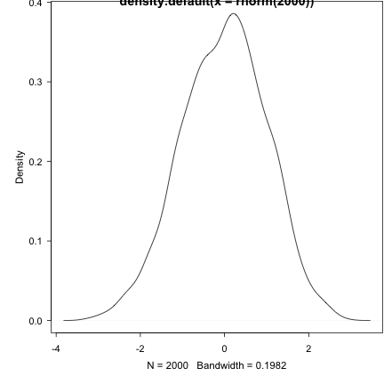

# This is a report generated for file inst/test.R


This report was automatically generated with the R package **knitr**
(version 1.27).

*****************************************************************************
# Description :

Setup the reposotories used for the project install required packages

Programmer    : sffl
*****************************************************************************
This could be a more elaborate outline of what happens in the code
* Item 1
* Item 2
   + Item 2a
   + Item 2b

*****************************************************************************
# Setup of R configuration                                               ----

The RStudio package management system repos are setup and all used packages
are installed based on the selected repos.
*****************************************************************************
## Setup repos --------------------------------------------------------------


```r
message("Session environment")
```

```
## Session environment
```

```r
sessionInfo()
```

```
## R version 3.6.2 (2019-12-12)
## Platform: x86_64-apple-darwin15.6.0 (64-bit)
## Running under: macOS Catalina 10.15.2
## 
## Matrix products: default
## BLAS:   /Library/Frameworks/R.framework/Versions/3.6/Resources/lib/libRblas.0.dylib
## LAPACK: /Library/Frameworks/R.framework/Versions/3.6/Resources/lib/libRlapack.dylib
## 
## locale:
## [1] da_DK.UTF-8/da_DK.UTF-8/da_DK.UTF-8/C/da_DK.UTF-8/da_DK.UTF-8
## 
## attached base packages:
## [1] stats     graphics  grDevices utils     datasets  methods   base     
## 
## loaded via a namespace (and not attached):
##  [1] zip_2.0.4         Rcpp_1.0.3        highr_0.8         plyr_1.8.5       
##  [5] cellranger_1.1.0  pillar_1.4.3      compiler_3.6.2    tools_3.6.2      
##  [9] digest_0.6.23     zeallot_0.1.0     rmsfact_0.0.3     evaluate_0.14    
## [13] lubridate_1.7.4   lifecycle_0.1.0   tibble_2.1.3      gtable_0.3.0     
## [17] pkgconfig_2.0.3   rlang_0.4.2       openxlsx_4.1.4    rstudioapi_0.10  
## [21] xfun_0.12         xml2_1.2.2        dplyr_0.8.3       stringr_1.4.0    
## [25] knitr_1.27        vctrs_0.2.1       hms_0.5.3         grid_3.6.2       
## [29] cowplot_1.0.0     tidyselect_0.2.5  glue_1.3.1        data.table_1.12.8
## [33] R6_2.4.1          readxl_1.3.1      rmarkdown_2.0     tidyr_1.0.0      
## [37] readr_1.3.1       ggplot2_3.2.1     purrr_0.3.3       NNR_0.3.301      
## [41] magrittr_1.5      htmltools_0.4.0   backports_1.1.5   scales_1.1.0     
## [45] fortunes_1.5-4    assertthat_0.2.1  colorspace_1.4-1  stringi_1.4.5    
## [49] cowsay_0.7.0      lazyeval_0.2.2    munsell_0.5.0     crayon_1.3.4
```

```r
a <- 2
saveRDS(a, file = "inst/test.rds")

print("some_log")
```

```
## [1] "some_log"
```

```r
cat("also this \n")
```

```
## also this
```

```r
warning("this is a warning")
```

```
## Warning: this is a warning
```

```r
#stop("this is an error")

plot(density(rnorm(2000)))
```



A script comment that includes **markdown** formatting.

# session info
The R session information (including the OS info, R version and all
packages used):


```r
sessioninfo::session_info()
```

```
## ─ Session info ───────────────────────────────────────────────────────────────
##  setting  value                       
##  version  R version 3.6.2 (2019-12-12)
##  os       macOS Catalina 10.15.2      
##  system   x86_64, darwin15.6.0        
##  ui       X11                         
##  language (EN)                        
##  collate  da_DK.UTF-8                 
##  ctype    da_DK.UTF-8                 
##  tz       America/Los_Angeles         
##  date     2020-01-30                  
## 
## ─ Packages ───────────────────────────────────────────────────────────────────
##  package     * version date       lib source        
##  assertthat    0.2.1   2019-03-21 [1] CRAN (R 3.6.0)
##  backports     1.1.5   2019-10-02 [1] CRAN (R 3.6.0)
##  cellranger    1.1.0   2016-07-27 [1] CRAN (R 3.6.0)
##  cli           2.0.1   2020-01-08 [1] CRAN (R 3.6.0)
##  colorspace    1.4-1   2019-03-18 [1] CRAN (R 3.6.0)
##  cowplot       1.0.0   2019-07-11 [1] CRAN (R 3.6.0)
##  cowsay        0.7.0   2018-09-18 [1] CRAN (R 3.6.0)
##  crayon        1.3.4   2017-09-16 [1] CRAN (R 3.6.0)
##  data.table    1.12.8  2019-12-09 [1] CRAN (R 3.6.0)
##  digest        0.6.23  2019-11-23 [1] CRAN (R 3.6.0)
##  dplyr         0.8.3   2019-07-04 [1] CRAN (R 3.6.0)
##  evaluate      0.14    2019-05-28 [1] CRAN (R 3.6.0)
##  fansi         0.4.1   2020-01-08 [1] CRAN (R 3.6.0)
##  fortunes      1.5-4   2016-12-29 [1] CRAN (R 3.6.0)
##  ggplot2       3.2.1   2019-08-10 [1] CRAN (R 3.6.0)
##  glue          1.3.1   2019-03-12 [1] CRAN (R 3.6.0)
##  gtable        0.3.0   2019-03-25 [1] CRAN (R 3.6.0)
##  highr         0.8     2019-03-20 [1] CRAN (R 3.6.0)
##  hms           0.5.3   2020-01-08 [1] CRAN (R 3.6.0)
##  htmltools     0.4.0   2019-10-04 [1] CRAN (R 3.6.0)
##  knitr         1.27    2020-01-16 [1] CRAN (R 3.6.0)
##  lazyeval      0.2.2   2019-03-15 [1] CRAN (R 3.6.0)
##  lifecycle     0.1.0   2019-08-01 [1] CRAN (R 3.6.0)
##  lubridate     1.7.4   2018-04-11 [1] CRAN (R 3.6.0)
##  magrittr      1.5     2014-11-22 [1] CRAN (R 3.6.0)
##  munsell       0.5.0   2018-06-12 [1] CRAN (R 3.6.0)
##  NNR           0.3.301 2020-01-30 [1] local         
##  openxlsx      4.1.4   2019-12-06 [1] CRAN (R 3.6.0)
##  pillar        1.4.3   2019-12-20 [1] CRAN (R 3.6.0)
##  pkgconfig     2.0.3   2019-09-22 [1] CRAN (R 3.6.0)
##  plyr          1.8.5   2019-12-10 [1] CRAN (R 3.6.0)
##  purrr         0.3.3   2019-10-18 [1] CRAN (R 3.6.0)
##  R6            2.4.1   2019-11-12 [1] CRAN (R 3.6.0)
##  Rcpp          1.0.3   2019-11-08 [1] CRAN (R 3.6.0)
##  readr         1.3.1   2018-12-21 [1] CRAN (R 3.6.0)
##  readxl        1.3.1   2019-03-13 [1] CRAN (R 3.6.0)
##  rlang         0.4.2   2019-11-23 [1] CRAN (R 3.6.0)
##  rmarkdown     2.0     2019-12-12 [1] CRAN (R 3.6.0)
##  rmsfact       0.0.3   2016-08-04 [1] CRAN (R 3.6.0)
##  rstudioapi    0.10    2019-03-19 [1] CRAN (R 3.6.0)
##  scales        1.1.0   2019-11-18 [1] CRAN (R 3.6.0)
##  sessioninfo   1.1.1   2018-11-05 [1] CRAN (R 3.6.0)
##  stringi       1.4.5   2020-01-11 [1] CRAN (R 3.6.0)
##  stringr       1.4.0   2019-02-10 [1] CRAN (R 3.6.0)
##  tibble        2.1.3   2019-06-06 [1] CRAN (R 3.6.0)
##  tidyr         1.0.0   2019-09-11 [1] CRAN (R 3.6.0)
##  tidyselect    0.2.5   2018-10-11 [1] CRAN (R 3.6.0)
##  vctrs         0.2.1   2019-12-17 [1] CRAN (R 3.6.0)
##  withr         2.1.2   2018-03-15 [1] CRAN (R 3.6.0)
##  xfun          0.12    2020-01-13 [1] CRAN (R 3.6.0)
##  xml2          1.2.2   2019-08-09 [1] CRAN (R 3.6.0)
##  zeallot       0.1.0   2018-01-28 [1] CRAN (R 3.6.0)
##  zip           2.0.4   2019-09-01 [1] CRAN (R 3.6.0)
## 
## [1] /Library/Frameworks/R.framework/Versions/3.6/Resources/library
```

```r
Sys.time()
```

```
## [1] "2020-01-30 06:37:22 PST"
```

